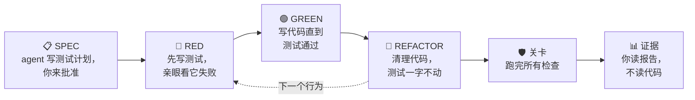

<p align="center">
  
</p>

# old-coder skill（老码农 skill）

> 本文是 [README.md](README.md) 的中文版。

**老码农在 Agent 时代的智慧：不读代码，让代码闯过层层关卡。**

一个让 coding agent **自证其码**的 skill。你不用逐行读 agent 写的代码——agent 必须让代码闯过一整套检查关卡，并且在写代码前交给你一份测试计划、写完后交给你一份证据报告。你审的是这两份文档，不是代码。

skill 就是纯 markdown，任何能遵循指令的 coding agent 都能用：Claude Code、Codex CLI、Cursor、Aider，或你自己的 agent loop。

> **本仓库是 [amazingang/old-coder](https://github.com/amazingang/old-coder) 的 fork**（MIT）。
> loop、gauntlet 和 demo 都是上游的工作；本 fork 增加了隔离、持久化产物、以 agent 定义的两道评审，
> 以及 SPEC/EVIDENCE 模板。完整来源说明、上游致谢，以及逐个 commit 的改动清单见
> **[ATTRIBUTION.md](ATTRIBUTION.md)**（英文）。

## 安装

```sh
npx skills add https://github.com/amazingang/old-coder
```

这条命令只装 skill 本体。两个评审 agent 在 skill 目录之外，需要另外拷一份——从本仓库的 clone 里：

```sh
cp agents/*.md ~/.claude/agents/    # 或 <project>/.claude/agents/
```

也可以两部分都手动安装：

- **Claude Code**——把 skill 拷进 skills 文件夹，把两个评审 agent 拷进 agents 文件夹，然后用 `/old-coder` 调用，或在"证明它能用"这类请求时让它自动触发：
  ```sh
  cp -r skills/old-coder ~/.claude/skills/    # 或 <project>/.claude/skills/
  cp agents/*.md ~/.claude/agents/            # 或 <project>/.claude/agents/
  ```
  这两个 agent 是 `spec-intent` 和 `adversary`，对应流程里的两道评审。不装也能跑——skill 会退回到用 agent 文件正文作为 brief 的通用 subagent——所以这两个文件请留在手边。
- **其他 agent**——把 `skills/old-coder/SKILL.md` 加进你的 `AGENTS.md`、规则文件或 system prompt，并把 `references/gauntlet.md` 放在旁边备查。如果你的 agent 不支持用定义文件拉起 subagent，就把 `agents/spec-intent.md` 和 `agents/adversary.md` 的正文当作这两道评审的 brief。


## 核心想法

本项目启发于 Uncle Bob（Robert C. Martin）关于 coding agent 协作的观点（[原推文](https://x.com/unclebobmartin/status/2080257779395154409)）：

> 我目前的策略是完全不读 agent 写的任何代码。只有这样，我才能真正享受它们带来的生产力。我做的是用极端的约束把 agent 包围起来：单元测试、gherkin 测试、QA 流程、质量指标、mutation testing、测试覆盖率，以及其他一大堆手段。最终我对它们产出的代码有非常高的信心，因为这些代码闯过了我所有约束和测试组成的关卡（gauntlet）。

既然你不打算读代码，那你**确实要读**的东西就必须能承载这份信任。

## 工作方式




你只需要读两份文档：

- **SPEC**（写代码之前）——代码必须做什么、必须不做什么的具体例子，外加 agent 想装哪些工具。批准它，是你唯一要做的决定。
- **证据**（写完代码之后）——来自最后一次完整运行的真实数字，你自己一条命令就能重跑验证。

中间的“关卡”：


| 检查                | 它回答的问题            |
| ----------------- | ----------------- |
| 全量测试              | 有没有东西被改坏？         |
| 类型 + lint + 复杂度   | 有没有低级错误？函数有没有写得复杂到没人看得懂？ |
| 改动行覆盖率            | 每一行新代码都真的被测试跑到了吗？ |
| Mutation testing  | 故意埋 bug——测试能抓到吗？  |
| Property-based 测试 | 几百个随机输入下规则还成立吗？   |
| 真实执行              | 离开测试环境，它真的能跑吗？    |
| 供应链 + 密钥          | agent 有没有偷偷引入危险的包、泄漏密钥？ |
| 套件健康              | 测试本身稳定吗？换个顺序还全过吗？ |

此外还有一份按风险模型逐任务点选的领域菜单——并发、UI 检查、API 兼容性、性能、可观测性（见 `references/gauntlet.md`）。

投入随风险分级：改个错别字只跑一两项检查；涉及金钱、登录、数据、并发的改动全部都跑——agent 还要先用恶意输入攻击自己的代码。

## 如何防止 agent 作弊

agent 是在给自己的作业打分，所以规则很严：不许为通过而弱化测试；不许报告没跑过的检查；没验证的条目只能标 `unverified`，不许标 `pass`；如果没有人批准过 spec，报告必须如实写明，并降低置信声明。

还有一条明说的边界：关卡把 spec 中表达的约束转化为可执行证据；它既不能证明 spec 完整，也不能自行证明 checker 和映射可靠。所以 SPEC 要由你批准，证据报告给出的只能是有边界、可审计的置信，而不是绝对证明。

## 仓库里有什么

```
skills/old-coder/         skill 本体（SKILL.md + references/gauntlet.md）
agents/                   两个评审 subagent（spec-intent、adversary）
demo-rate-limiter/        按此 skill 端到端做出来的限流器示例
```

demo 的 `evidence.md` 就是重点：41 个测试、100% 覆盖率（49/49 个语句、20/20 个分支），22/22 个埋入的 bug 全部被抓。更重要的是，对此前绿色状态进行的 fresh-context verification 仍发现了真实的行为缺陷和一个不可靠的 mutation runner——这恰好说明，关卡全绿并不能自证其可信。当前报告同时披露了修复情况和最终源码状态的验证状态。整份报告可以重跑：

```sh
cd demo-rate-limiter
python3 -m venv .venv && .venv/bin/pip install -r requirements-dev.txt -e .
./tools/gauntlet.sh
```


## 许可证

MIT —— `Copyright (c) 2026 amazingang`，本 fork 的修改另行署名。
见 [`LICENSE`](LICENSE) 与 [`ATTRIBUTION.md`](ATTRIBUTION.md)。

`references/gauntlet.md` 和 `agents/adversary.md` 中有一类失败模式改编自
`adversarial-agent-review` skill v1.0.1（Apache-2.0），出处见
[`ATTRIBUTION.md`](ATTRIBUTION.md)。
