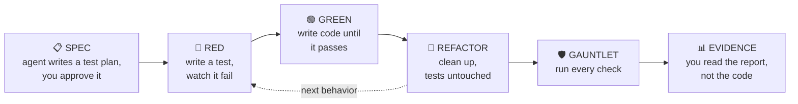

<p align="center">
  
</p>

# Old Coder skill（老码农 skill）

*[中文说明 →](README-zh.md)*

**An old coder's strategy for the agent era: don't read the code — make it run the gauntlet.**

A skill that makes coding agents **prove their work**. Instead of you reading every line the agent writes, the agent must push its code through a gauntlet of checks — and hand you a test plan before coding and an evidence report after. You review those two documents, not the code.

It's plain markdown, so it works with any coding agent that follows instructions: Claude Code, Codex CLI, Cursor, Aider, or your own agent loop.

> **This is a fork of [amazingang/old-coder](https://github.com/amazingang/old-coder)** (MIT).
> The loop, the gauntlet, and the demo are upstream's work — this fork adds isolation,
> durable artifacts, agent-defined reviews, and artifact templates. Full provenance,
> upstream credits, and a commit-by-commit list of what changed: **[ATTRIBUTION.md](ATTRIBUTION.md)**.

## Installation

```sh
npx skills add https://github.com/amazingang/old-coder
```

That installs the skill only. The two review agents live outside the skill folder, so copy them in as well — from a clone of this repo:

```sh
cp agents/*.md ~/.claude/agents/    # or <project>/.claude/agents/
```

Or manually, both parts:

- **Claude Code** — copy the skill into a skills folder and the two review agents into an agents folder, then invoke `/old-coder` or let it trigger on "prove it works"-style requests:
  ```sh
  cp -r skills/old-coder ~/.claude/skills/    # or <project>/.claude/skills/
  cp agents/*.md ~/.claude/agents/            # or <project>/.claude/agents/
  ```
  The agents are `spec-intent` and `adversary`, the two review layers of the loop. Without them the skill still runs — it falls back to a general-purpose subagent briefed from the agent file — so keep those files where you can read them.
- **Other agents** — add `skills/old-coder/SKILL.md` to your `AGENTS.md`, rules file, or system prompt, and keep `references/gauntlet.md` alongside it. If your agent can't spawn subagents from a definition file, use `agents/spec-intent.md` and `agents/adversary.md` as the briefs for the two review passes.

## The idea

From Uncle Bob (Robert C. Martin), on working with coding agents ([original tweet](https://x.com/unclebobmartin/status/2080257779395154409)):

> My current strategy is to not read any of the code written by my agents. That’s the only way I can take advantage of their productivity. What I do instead is to surround the agents with extreme constraints. Unit tests, gherkin tests, QA procedures, quality metrics, mutation testing, test coverage, and a plethora of others. In the end, I have very high confidence in the code they produce because they’ve had to run the gauntlet of all of my constraints and tests.

If you're not going to read the code, the things you *do* read have to carry the trust instead.

## How it works



You read two documents:

- **SPEC** (before any code) — concrete examples of what the code must and must not do, plus which tools the agent wants to install. Approving it is the single yes/no you give.
- **EVIDENCE** (after the code) — real numbers from one final fresh run, rerunnable yourself with a single command.

The gauntlet in between:

| Check | The question it answers |
|---|---|
| Full test suite | Did anything break? |
| Types + lint + complexity | Any obvious mistakes? Any unreadable tangles? |
| Changed-line coverage | Is every new line actually exercised by a test? |
| Mutation testing | Plant bugs on purpose — do the tests catch them? |
| Property-based tests | Do the rules survive hundreds of random inputs? |
| Real execution | Does it actually run, outside the test harness? |
| Supply chain & secrets | Did the agent quietly pull in risky packages, or leak a key? |
| Suite health | Are the tests themselves stable, in any order? |

Plus a menu of domain-specific layers — concurrency, UI checks, API compatibility, performance, observability — picked per task from a risk model (see `references/gauntlet.md`).

Effort scales with risk: a typo fix runs a couple of checks; anything touching money, logins, data, or concurrency runs everything — plus the agent attacks its own code with hostile inputs first.

## Keeping the agent honest

The agent grades its own homework, so the rules are strict: never weaken a test to make it pass; never report a check that didn't run; anything unverified is labeled `unverified`, never `pass`; if no human approved the spec, the report must say so and claim less confidence.

And one limit stated plainly: the gauntlet turns the constraints expressed in the spec into executable evidence; it cannot prove the spec is complete or authenticate its own checkers and mappings. That's why you approve the SPEC, and why EVIDENCE reports bounded, auditable confidence rather than absolute proof.

## What's in the repo

```
skills/old-coder/         the skill (SKILL.md + references/)
  references/gauntlet.md    the layer catalogue and risk model
  references/setup.md       how rules are read, isolation, artifact layout
  references/templates.md   the SPEC and EVIDENCE templates
  references/verifier.md    independent verification (separate from the gauntlet)
agents/                   the two review subagents (spec-intent, adversary)
demo-rate-limiter/        a rate limiter built end-to-end under the skill
CUSTOMIZATION.md          how to configure the skill with rules
ATTRIBUTION.md            provenance, upstream credits, what this fork changed
```

The demo's `evidence.md` is the point of the exercise: 41 tests, 100% coverage (49/49 statements and 20/20 branches), and 22/22 planted bugs caught. More importantly, fresh-context verification of earlier green states still found real behavioral defects and an unsound mutation runner — evidence that a green gauntlet is not self-authenticating. The current report discloses both the fixes and the final state's verification status. Rerun the whole report:

```sh
cd demo-rate-limiter
python3 -m venv .venv && .venv/bin/pip install -r requirements-dev.txt -e .
./tools/gauntlet.sh
```

## Configuration

**There is no config file.** The skill reads its settings from the rule files your
agent already loads — `CLAUDE.md`, `AGENTS.md`, a rules directory. Adding a format
would be one more thing every agent has to know about, and the point of this skill
is that it is plain markdown any agent can follow.

Scope carries the permission model:

- **User rules** (not in the repo) hold **grants** — may commit, may install, may
  post to a tracker, may fill a PR body.
- **Project rules** (committed) hold **facts and restrictions** — the real test and
  lint commands, required signing, isolation.

A grant found in a committed file is not honored: it would authorize every agent
run by everyone who clones the repo. Absent any rule, the skill asks first.

Two things no rule can turn on: it **never pushes** and **never opens a pull
request**.

→ **[CUSTOMIZATION.md](CUSTOMIZATION.md)** has copy-pasteable rules per scenario —
committing as it goes, putting EVIDENCE in a PR body, pinning the project's real
commands, locking it down harder, unattended runs.

## License

MIT — `Copyright (c) 2026 amazingang`, with modifications in this fork.
See [`LICENSE`](LICENSE) and [`ATTRIBUTION.md`](ATTRIBUTION.md).

Portions of `references/gauntlet.md` and `agents/adversary.md` adapt one failure
class from the `adversarial-agent-review` skill v1.0.1 (Apache-2.0), cited in
[`ATTRIBUTION.md`](ATTRIBUTION.md).
